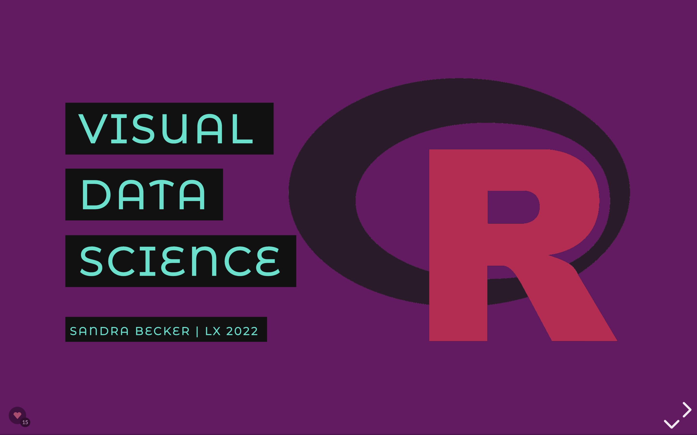
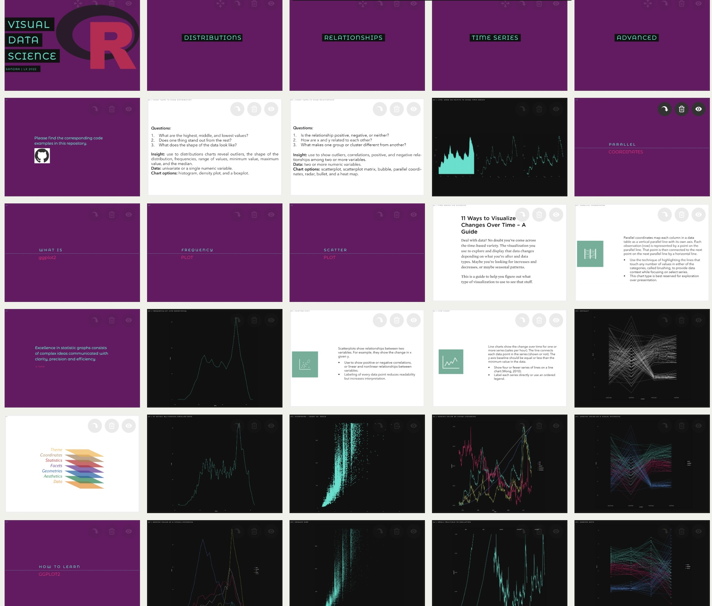
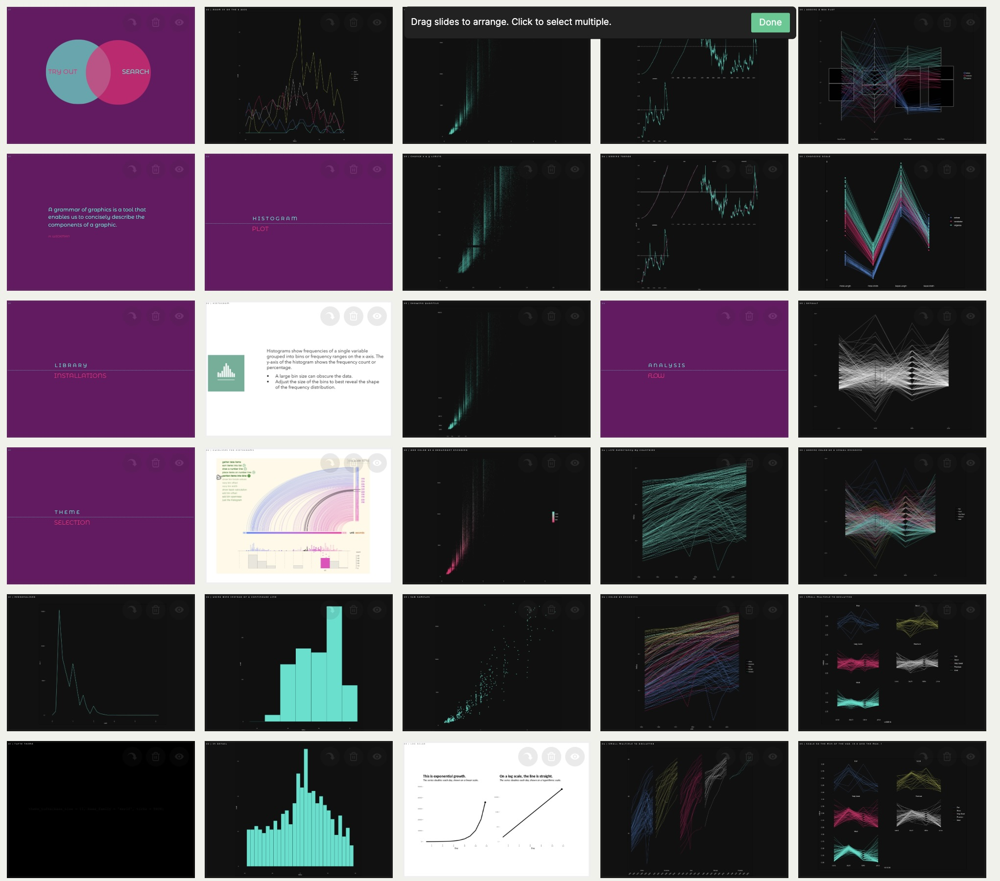
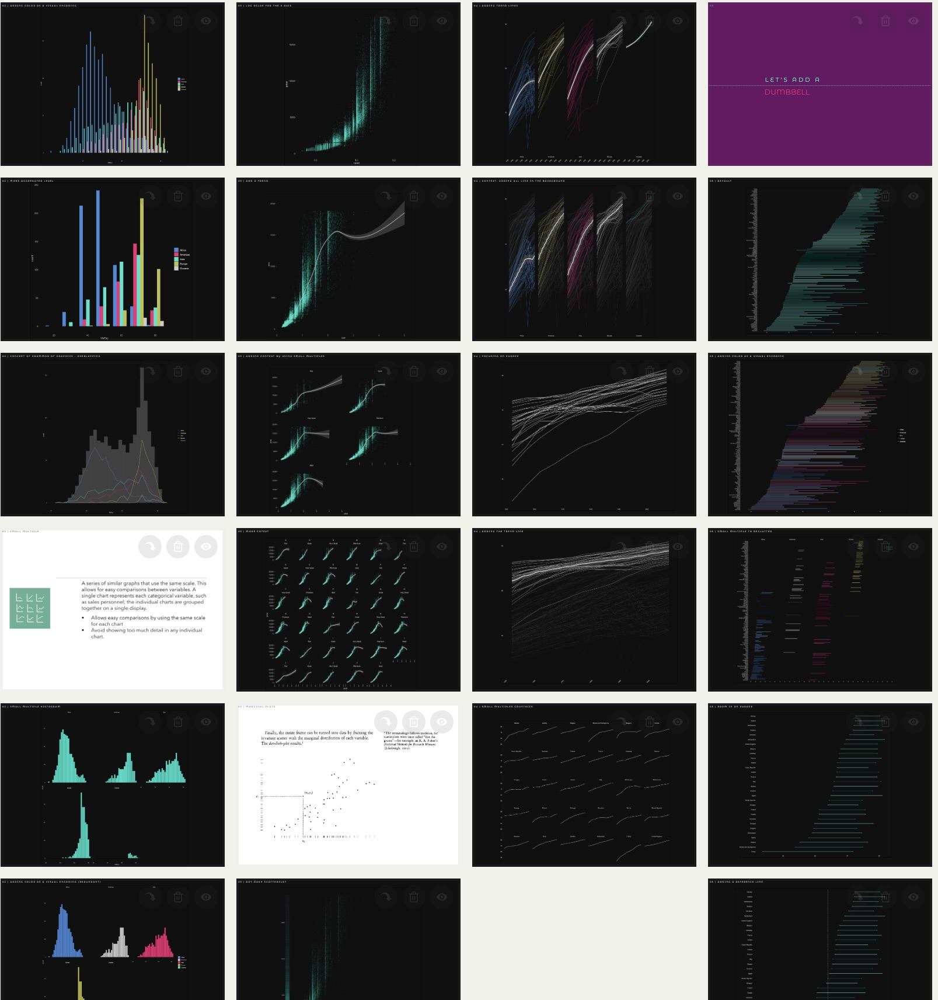

# Visual data science

Please check the corresponding [presentation](https://slides.com/sandraviz/rggplot2/embed?style=light) as well as corresponding [video tutorials](https://youtube.com/playlist?list=PL53pYdoYDFiv2PFCiuXR53PZj9bZrZpyp)

Explorative data visualisation is a very important part when analyising the structure in our data. It should always be one of the first steps when starting a new data science project. 

### Setup 

In case this is your first time using R you need to install your own copy as well as RStudio, a software application that makes R easier to use. Both R and RStudio are free and easy to download. R is maintained by an international team of developers. The top of the web page provides three links for downloading R. Under this [link](https://posit.co/products/open-source/rstudio/) you can download Rstudio 

### Introduction 

In this chapter I introduce the concept of the R visualisation package ggplot. Regarding the installation please check the [code](https://github.com/sandravizz/visual-data-science-R/blob/main/Scripts/Installations.R). Afterwards it is the next step to define a theme, please check the [code](https://github.com/sandravizz/visual-data-science-R/blob/main/Scripts/Themes.R).

### Distributions 

In this chapter we look at different visualisation types showing the distribution of one variables. Please check the [code](https://github.com/sandravizz/visual-data-science-R/blob/main/Scripts/Distributions.R).

Chart types covered

- Frequency plot 
- Histogram 
- Box-plot
- Density plot

### Relationships 

In this chapter we look at different visualisation types presenting the relationships between two variables. Please check the [code](https://github.com/sandravizz/visual-data-science-R/blob/main/Scripts/Explorative%20analysis.R).

Chart types covered

- Scatter plot 
- Beeswarm plot 
- Hexagonal binning
- Heatmap

### Time series 

Time series data have a very specific structure. The goal is to understand over time patterns (trends) which are often presented as line charts. The focus of this chapter is on the visual analytical flow when investigating patterns over time. Please check the [code](https://github.com/sandravizz/visual-data-science-R/blob/main/Scripts/Time%20series.R).

### Advanced visualisations 

In this chapter I present three more advanced visualisation types as their strucutre is less commonly used and/or cover higer visual complexity. Pleased check the [code](https://github.com/sandravizz/visual-data-science-R/blob/main/Scripts/Advanced%20visualisations.R).

Chart types covered

- Parallel coordinates 
- Dumbbell chart
- Waffle chart

### Markdown 

The markdown option is a good way to save the whole project including comments and summaries. Please check the [code](https://github.com/sandravizz/visual-data-science-R/blob/main/Scripts/Markdown.R).

